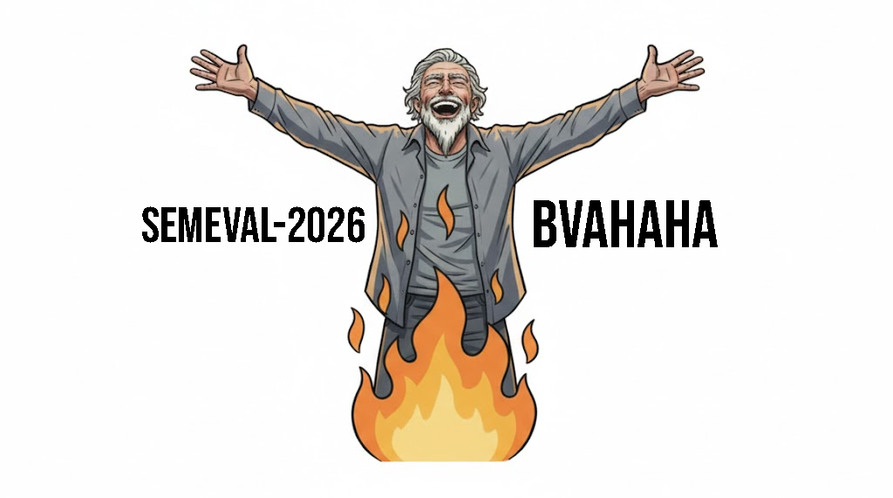

<p align="center">
  
</p>
<p align="center"><sub>Logo created by Gemini 3.1 Pro.</sub></p>

# XplaiNLP at SemEval-2026 Task 1: BVAHAHA

**Benign Violation Algorithm for Humor And Harmless Absurdity**

Official code, prompts, and evaluation scripts for the system paper:

> Berk Bubus, Nebi Soyal, Vera Schmitt, Nils Feldhus, and Veronika Solopova. 2026.
> [*XplaiNLP at SemEval-2026 Task 1: BVAHAHA - Benign Violation Algorithm for Humor and Harmless Absurdity.*](https://aclanthology.org/2026.semeval-1.195/)
> In Proceedings of the 20th International Workshop on Semantic Evaluation (2026), pages 1501–1510,
> San Diego, California, USA. Association for Computational Linguistics.

BVAHAHA is a humor-generation system for **SemEval-2026 Task 1 (MWAHAHA, Subtask A)**. Given
either two rare words or a news headline, it generates a contextually appropriate joke while
avoiding memorization and unsafe outputs. The approach combines:

1. **BVT-guided generation** — prompting grounded in Benign Violation Theory (identify a violation →
   make it benign → ensure simultaneity).
2. **A parallel "Gatekeeper" moderation layer** — emotion and hate-speech classifiers that trigger an
   iterative revision loop when a joke crosses the safety threshold.
3. **An LLM-as-a-Judge evaluation** — persona-based ranking that approximates human humor preferences.

This repository focuses on the **English** subtask, where the full integrated pipeline was deployed.

---

## Repository structure

```
BVAHAHA/
├── generation/
│   ├── lets_run.py                 # BVT-Generator + Gatekeepers + revision loop (§3)
│   └── validation/
│       └── emotion_graph.py        # Gatekeeper threshold validation (Appendix C / Figure 3)
│
├── evaluation/
│   ├── category_persona.py         # Persona generator via GPT-4.1 (Appendix B.1)
│   ├── joke_scoring.py             # LLM-as-a-Judge scoring via GPT-4o (§4)
│   ├── statistic.py                # Heatmap + per-category statistics (Figure 2 / Table 1)
│   ├── counter.py                  # Small API-call counter helper
│   ├── categorizedAll300.txt       # Joke id -> multi-label assignments over the 17 categories (joke text removed)
│   ├── categories/                 # 19 persona-generator prompts (meta-prompt kept; seed jokes removed)
│   ├── category_personas/          # 19 generated rater personas (17 categories + cheesy_2 + general_categories)
│   └── scores/                     # Per-persona joke scores (scores_output__*.tsv)
│
├── task-a-en.tsv                   # Joke-corpus schema stub (header only; jokes removed)
├── requirements.txt
├── .env.example
└── .gitignore
```

---

## Setup

```bash
git clone https://github.com/berkbubus/BVAHAHA.git
cd BVAHAHA

python -m venv venv
source venv/bin/activate        # Windows: venv\Scripts\activate

pip install -r requirements.txt

cp .env.example .env             # then fill in your API keys
```

The pipeline uses two providers:

| Variable | Used by | Model |
|---|---|---|
| `OPENROUTER_API_KEY` | `generation/lets_run.py` | `google/gemini-3-flash-preview` |
| `OPENAI_API_KEY` | `evaluation/category_persona.py`, `evaluation/joke_scoring.py` | `gpt-4.1`, `gpt-4o` |

The Gatekeeper classifiers are pulled from the Hugging Face Hub on first run:
`michelleli99/emotion_text_classifier`, `tae898/emoberta-large`, and `IMSyPP/hate_speech_en`.

---

## Stage 1 — Generation

`generation/lets_run.py` reads a constraint file, generates a BVT-guided joke per row, runs it through
the three Gatekeepers, and revises up to three times if the hate-speech thresholds are met
(`L ∈ {2, 3}` and `P(L) > 0.30`).

**Input schema.** The script expects a TSV with the columns `id`, `word1`, `word2`, `headline`
(headline rows use `-` for the word columns, and vice-versa). This official Subtask A input is
distributed by the task organizers and is **not** included here — supply your own constraint file
in this schema before running.

> Note: `task-a-en.tsv` at the repository root is the schema stub for the **generated joke corpus**
> (columns `id`, `text`) consumed by the evaluation stage — not the generation input. The jokes
> themselves have been removed (see [Data availability](#data-availability)); populate it with an
> `id`/`text` TSV to run the evaluation.

```bash
cd generation
python lets_run.py      # writes en-last.tsv
```

## Stage 2 — Evaluation

The evaluation stage scores jokes with an LLM-as-a-Judge primed by category-specific rater personas.
Run these commands from inside `evaluation/`.

Jokes are multi-labelled over **17 humor categories**. Each category yields a rater persona; the repo
ships **19** personas — the 17 categories plus two variants noted in the paper: `cheesy_2` (a second
cheesy persona with extra examples) and `general_categories` (primed on the first 50 dataset jokes).

**1. (Optional) Regenerate a persona** from its prompt in `categories/`:

```bash
cd evaluation
python category_persona.py
```

The pre-generated personas are already provided in `category_personas/`, so this step is only needed
to reproduce them.

**2. Score the joke corpus** with each persona:

```bash
python joke_scoring.py      # writes scores_output__<persona>.tsv and token_usage__<persona>.tsv
```

> The shipped `task-a-en.tsv` is an empty schema stub (jokes removed, see
> [Data availability](#data-availability)). Populate it with your own `id`/`text` corpus first; the
> pre-computed `scores/` files are provided so `statistic.py` can be run without re-scoring.

**3. Aggregate into the heatmap and statistics** (Figure 2 / Table 1):

```bash
python statistic.py         # writes normalized_personas_categories_heatmap.png + category_detailed_statistics.csv
```

## Appendix C — Gatekeeper threshold validation

`generation/validation/emotion_graph.py` reproduces the dark-humor / hate-speech validation heatmap
(Figure 3) that motivates the `P(L) > 0.30` threshold.

The validation set is a collection of **publicly available, web-scraped dark-humor jokes and deadpan
one-liners**. This is third-party content, so it is **not redistributed in this repository**. To
reproduce Figure 3, supply your own file named `dark_humor_validation.txt` next to the script, with
**one joke per line**:

```bash
cd generation/validation
python emotion_graph.py      # reads dark_humor_validation.txt, writes the triple-model heatmaps
```

See [Data availability](#data-availability) for details on this validation set.

---

## Data availability

To keep the public release free of third-party and task-restricted joke text, the following data has
been **removed** from this repository. The *code, prompts, personas, category annotations, and score
outputs are all retained*, so the pipeline structure is fully documented — you only need to supply the
raw jokes to re-run it end to end.

| Removed | Where | Why | To reproduce |
|---|---|---|---|
| **Generation input** (`id`, `word1`, `word2`, `headline`) | `generation/` (never shipped) | Official SemEval-2026 Subtask A data, distributed by the task organizers | Obtain it from the [task organizers](https://semeval.github.io/SemEval2026/) and pass it to `lets_run.py` |
| **Generated joke corpus** | `task-a-en.tsv` (header-only stub) | The team's Subtask A submission jokes; not redistributed here | Provide an `id`/`text` TSV of jokes to score |
| **Seed jokes in persona prompts** | `## 6. Input Jokes` in `evaluation/categories/*.md` | Same submission jokes used to prime each persona | Append the seed jokes per category (`Joke: <text>`) to regenerate personas |
| **Joke text in category annotations** | `evaluation/categorizedAll300.txt` | Same submission jokes; only the id→label mapping is needed for stats | Retained id→category labels are sufficient for `statistic.py` |
| **Dark-humor validation set** | `dark_humor_validation.txt` (not shipped) | Publicly available but **web-scraped, third-party** dark-humor jokes and deadpan one-liners | Provide one joke per line for `emotion_graph.py` |

**Retained** (contain no joke text): `category_personas/*.txt` (rater policies), `scores/*.tsv`
(id + numeric score), and all pipeline code.

As described in the paper (Appendix C), the threshold validation used a custom set of publicly
available, web-scraped dark-humor jokes and deadpan one-liners. In keeping with the paper, we note
only that such a set was used rather than redistributing the jokes; provide your own to reproduce
Figure 3.

---

## Reproducibility notes

The scripts are published as submitted, so a few paths/values are hardcoded. Adjust these to match
your layout before running:

- **`joke_scoring.py`** reads personas from `./cheesy2` and the corpus from `../task-a-en.tsv`.
  Point `personas_dir` at `category_personas/` (and the corpus path as needed) to score against all
  personas.
- **`category_persona.py`** is wired to the `cheesy_2` category. Change the input/output paths to
  regenerate a different (or every) persona.
- **`lets_run.py`** reads its OpenRouter key from the `API_KEY` variable at the top of the file; set it
  from your environment / `.env`.

---

## Citation

If you use this work, please cite the system paper:

```bibtex
@inproceedings{bubus-etal-2026-xplainlp,
    title = "{X}plai{NLP} at {S}em{E}val-2026 Task 1: {BVAHAHA} - Benign Violation Algorithm for Humor and Harmless Absurdity",
    author = "Bubus, Berk  and
      Soyal, Nebi  and
      Schmitt, Vera  and
      Feldhus, Nils  and
      Solopova, Veronika",
    editor = "Kochmar, Ekaterina  and
      Ghosh, Debanjan  and
      North, Kai  and
      Komachi, Mamoru",
    booktitle = "Proceedings of the 20th {I}nternational {W}orkshop on {S}emantic {E}valuation (2026)",
    month = jul,
    year = "2026",
    address = "San Diego, California, USA",
    publisher = "Association for Computational Linguistics",
    url = "https://aclanthology.org/2026.semeval-1.195/",
    doi = "10.18653/v1/2026.semeval-1.195",
    pages = "1501--1510",
    ISBN = "979-8-89176-414-9",
}
```

The shared task:

```bibtex
@inproceedings{castro-etal-2026-semeval,
    title = "{S}em{E}val-2026 Task 1: {MWAHAHA}, Models Write Automatic Humor And Humans Annotate",
    author = "Castro, Santiago  and
      Chiruzzo, Luis  and
      G{\'o}ngora, Santiago  and
      Deng, Naihao  and
      Rahili, Salar  and
      Sastre, Ignacio  and
      Ros{\'a}, Aiala  and
      Amoroso, Victoria  and
      Rey, Guillermo  and
      Moncecchi, Guillermo  and
      Meaney, J. A.  and
      Prada, Juan Jos{\'e}  and
      Mihalcea, Rada",
    editor = "Kochmar, Ekaterina  and
      Ghosh, Debanjan  and
      North, Kai  and
      Komachi, Mamoru",
    booktitle = "Proceedings of the 20th {I}nternational {W}orkshop on {S}emantic {E}valuation (2026)",
    month = jul,
    year = "2026",
    address = "San Diego, California, USA",
    publisher = "Association for Computational Linguistics",
    url = "https://aclanthology.org/2026.semeval-1.454/",
    doi = "10.18653/v1/2026.semeval-1.454",
    pages = "3797--3822",
    ISBN = "979-8-89176-414-9",
}
```
